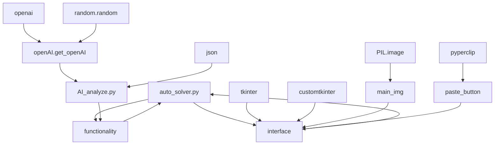

# RUS
## Описание
Решатель задач по физике - 
<br> python программа для анализа и решения физических задач введенных пользователем с использованием ***OpenAI (text-davinci-003)***. <br/>

## Требования 
  - python 3+ (рекомендовательно 3.11)
  - библиотеки:
    - [Tkinter](https://docs.python.org/3/library/tkinter.html)
    - [CustomTkinter](https://pypi.org/project/customtkinter/0.3/)
    - [OpenAI](https://github.com/openai/openai-python)
    - [PIL](https://pypi.org/project/Pillow/)
    - [Pyperclip](https://pypi.org/project/pyperclip/)

## Использование auto_solver.py (auto_solver.exe)
  0) Запустите основной файл auto_solver.py или auto_solver.exe.
  <br> <br/>
  1) Введите условие задачи в предназначенное для этого поле (с клавиатуры) или используя кнопку "Вставить".
  2) Для запуска программы нажмите кнопку "Пуск" или клавишу "Enter".
  3) Спустя %время% появится окно вывода программы (или окно ошибки).
  4) Вы можете редактировать окно программы, а затем нажав на сердечко рядом, сохранить решение (Теперь каждый раз при вводе этого условия, решение будет приходить быстрее).
  
## Алгоритм


## Использование openAI.get_openAI:
```
from openAI import get_openAI

if __name__ == "__main__":
  get_openAI(prompt: str) # -> str | None 
```
| параметр      | openAI              |
| ------------- | ------------------- |
| model_engine  | text-davinci-003  |
| max_tokens    | 3000                |
| temperature   | random()            |
| stop          | None                |

возвращает строку в случае успеха, в противном случае возвращает None 
